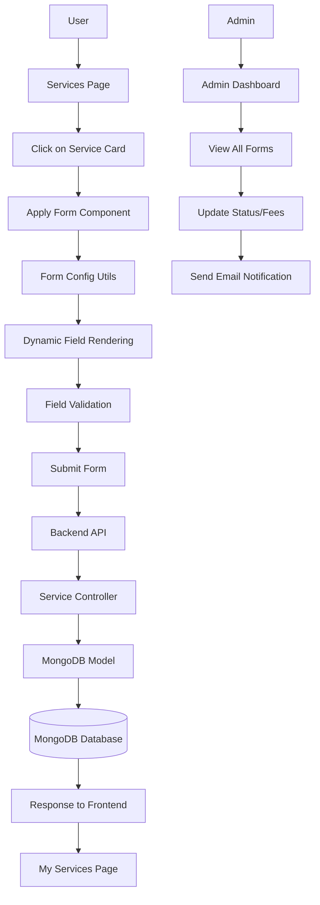
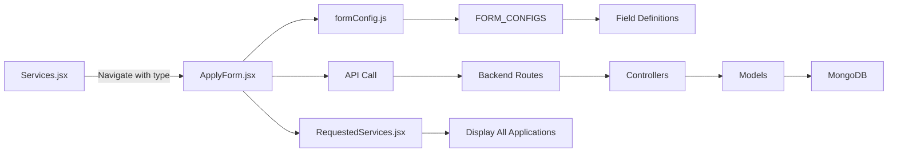

# System Architecture - Service Forms

## System Flow Diagram



## Component Architecture



## Data Flow for Each Service Type

```mermaid
sequenceDiagram
    participant U as User
    participant S as Services Page
    participant F as Apply Form
    participant C as Form Config
    participant A as API
    participant D as Database
    
    U->>S: Click Service Card
    S->>F: Navigate with ?type=caste
    F->>C: Get config for 'caste'
    C->>F: Return field definitions
    F->>U: Render form fields
    U->>F: Fill & Submit
    F->>A: POST /api/caste/apply
    A->>D: Save to castecer
tificateforms
    D->>A: Return saved document
    A->>F: Success response
    F->>U: Show success message
    U->>S: Navigate to My Services
```

## Form Configuration System

### File Structure
```
frontend/src/
├── utils/
│   └── formConfig.js          # Centralized form definitions
├── pages/
│   ├── Services.jsx           # Service cards with navigation
│   ├── ApplyForm.jsx          # Reusable form component
│   └── profile/
│       └── RequestedServices.jsx  # User's applications
```

### Backend Structure
```
backend/
├── models/
│   ├── panCardForm.js
│   ├── incomeCertificateForm.js
│   ├── casteCertificateForm.js      # NEW
│   ├── domicileCertificateForm.js   # NEW
│   └── propertyRegistrationForm.js  # NEW
├── controller/
│   ├── panControllers.js
│   ├── incomeControllers.js
│   ├── casteControllers.js          # NEW
│   ├── domicileControllers.js       # NEW
│   ├── propertyControllers.js       # NEW
│   └── adminControllers.js          # UPDATED
└── routes/
    ├── panRoutes.js
    ├── incomeRoutes.js
    ├── casteRoutes.js               # NEW
    ├── domicileRoutes.js            # NEW
    └── propertyRoutes.js            # NEW
```

## Service Types and Required Documents

### 1. PAN Card Application
**Documents Required:**
- Aadhar Card
- Date of Birth Proof
- Address Proof
- Passport Size Photo

**Form Fields:**
- Personal: Name, Father Name, Mother Name, DOB, Gender
- Contact: Phone, Email, Address
- Identity: Aadhar Number

### 2. Income Certificate
**Documents Required:**
- Aadhar Card
- Samagra ID
- Income Proof (Salary Slip/ITR)
- Residence Proof

**Form Fields:**
- Personal: Name, Father Name
- Financial: Income Amount (min ₹35,000)
- Identity: Aadhar, Samagra ID
- Contact: Phone, Email, Address

### 3. Caste Certificate
**Documents Required:**
- Aadhar Card
- Birth Certificate
- Parent's Caste Certificate
- Ration Card (optional)
- School Certificate

**Form Fields:**
- Personal: Name, Father Name, Mother Name, DOB, Gender
- Caste: Category (SC/ST/OBC), Sub-Caste
- Location: Address, District, State, Pincode
- Identity: Aadhar, Ration Card
- Contact: Phone, Email

### 4. Domicile Certificate
**Documents Required:**
- Aadhar Card
- Birth Certificate
- Residence Proof (15+ years)
- School Certificate
- Property Documents (if any)

**Form Fields:**
- Personal: Name, Father Name, Mother Name, DOB, Gender
- Birth: Place of Birth
- Residence: Permanent Address, Current Address, Years of Residence
- Location: District, State, Pincode
- Identity: Aadhar
- Contact: Phone, Email
- Optional: Occupation

### 5. Property Registration
**Documents Required:**
- Owner's Aadhar Card
- Sale Deed/Agreement
- Encumbrance Certificate
- Property Tax Receipt
- Survey/Khasra Documents
- NOC (if required)

**Form Fields:**
- Owner Details: Name, Father Name, Aadhar, Contact, Email, Address
- Property Details: Type, Address, District, State, Pincode, Area, Unit, Value
- Transaction: Type, Buyer Name, Buyer Contact, Previous Owner, Khata No., Khasra No.

## API Endpoints

### User Endpoints
| Method | Endpoint | Description |
|--------|----------|-------------|
| POST | `/api/pan/apply` | Submit PAN application |
| POST | `/api/income/apply` | Submit Income Certificate |
| POST | `/api/caste/apply` | Submit Caste Certificate |
| POST | `/api/domicile/apply` | Submit Domicile Certificate |
| POST | `/api/property/apply` | Submit Property Registration |
| GET | `/api/pan/myAllPan` | Get user's PAN applications |
| GET | `/api/income/myAll` | Get user's Income applications |
| GET | `/api/caste/myAll` | Get user's Caste applications |
| GET | `/api/domicile/myAll` | Get user's Domicile applications |
| GET | `/api/property/myAll` | Get user's Property applications |
| PUT | `/api/{service}/:id` | Update application |
| DELETE | `/api/{service}/:id` | Delete application |

### Admin Endpoints
| Method | Endpoint | Description |
|--------|----------|-------------|
| GET | `/api/admin/forms` | Get all applications (all types) |
| GET | `/api/admin/forms/:id` | Get specific form details |
| PATCH | `/api/admin/forms/:id/status` | Update status/fees/payment |
| POST | `/api/admin/forms/:id/notify` | Send email notification |
| GET | `/api/admin/stats/summary` | Get dashboard statistics |

## Database Schema

### Common Fields (All Forms)
- `userId`: Reference to User
- `serviceTitle`: String
- `status`: enum ['submitted', 'in_review', 'approved', 'rejected', 'success']
- `feeAmount`: Number
- `paymentStatus`: enum ['pending', 'received', '']
- `paymentReceivedAt`: Date
- `createdAt`: Timestamp
- `updatedAt`: Timestamp

### Service-Specific Fields
Each service has additional fields as defined in their respective models.

## Security Features

1. **Authentication**: JWT-based authentication required for all form submissions
2. **Authorization**: Users can only view/edit their own applications
3. **Validation**: 
   - Frontend: Real-time field validation
   - Backend: Server-side validation with specific patterns
4. **Data Sanitization**: All inputs are trimmed and validated
5. **CORS**: Configured to allow only trusted origins

## Performance Optimizations

1. **Parallel API Calls**: Fetch all service types simultaneously
2. **Memoization**: Form state and validation results are memoized
3. **Code Splitting**: Dynamic imports where applicable
4. **Database Indexing**: Indexes on userId, status, aadhar fields
5. **Lean Queries**: Only fetch required fields

## Scalability

### Adding New Service
1. Add model in `backend/models/`
2. Add controller in `backend/controller/`
3. Add route in `backend/routes/`
4. Register route in `backend/server.js`
5. Add config in `frontend/src/utils/formConfig.js`
6. Update admin controller to include new service
7. Update RequestedServices to fetch new service

### Example:
```javascript
// Add to formConfig.js
birth_certificate: {
  apiEndpoint: '/api/birth',
  fields: [
    { name: 'childName', label: 'Child Name', type: 'text', required: true },
    // ... more fields
  ]
}
```

No changes needed in ApplyForm.jsx - it automatically handles new services!

---

**Architecture Version:** 2.0
**Last Updated:** 2025-10-25
